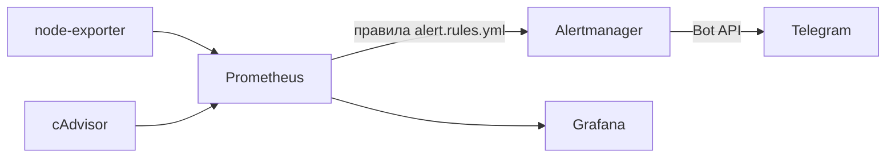

# Monitoring stack для VPS: Prometheus + Grafana + node-exporter + cAdvisor

Стек мониторинга на Docker Compose для одиночного VPS. Он собирает метрики самого сервера и контейнеров соседнего проекта `prod` (Flask + MySQL + nginx) и показывает их в Grafana.

Главный упор в проекте сделан на **сетевую безопасность**: наружу из этого стека не опубликовано ни одного порта, а единственный веб-интерфейс (Grafana) доступен только через SSH-туннель.

---

## Содержание

1. [Архитектура](#архитектура)
2. [Сетевая безопасность](#сетевая-безопасность)
3. [Быстрый старт](#быстрый-старт)
4. [Доступ к Grafana](#доступ-к-grafana)
5. [Кастомный дашборд состояния prod](#кастомный-дашборд-состояния-prod)
6. [Проверка безопасности](#проверка-безопасности)
7. [Структура репозитория](#структура-репозитория)
8. [Известные ограничения и планы](#известные-ограничения-и-планы)

---

## Архитектура

```
                      VPS (Docker host)
 ┌────────────────────────────────────────────────────────┐
 │                                                        │
 │   сеть "prod_default"          сеть "monitoring"       │
 │  ┌───────┐ ┌────────┐ ┌─────┐                          │
 │  │ nginx │ │backend │ │mysql│   ┌────────────────┐     │
 │  └───────┘ └────────┘ └─────┘   │  node-exporter │─┐   │
 │      ▲  (проект prod)           └────────────────┘ │   │
 │      │                          ┌────────────────┐ ▼   │
 │  127.0.0.1:8080                 │    cAdvisor    │─▶ Prometheus
 │                                 └────────────────┘     │
 │                                                  │     │
 │                                                  ▼     │
 │                                ┌─────────────────────┐ │
 │        127.0.0.1:3000 ◀────────│       Grafana       │ │
 │                                └─────────────────────┘ │
 └────────────────────────────────────────────────────────┘
                 ▲
                 │ SSH-туннель (ssh -L 3000:localhost:3000)
          ноутбук администратора
```

| Компонент | Что делает | Откуда берёт данные |
|---|---|---|
| **node-exporter** | Метрики хоста: CPU, RAM, swap, диск, сеть, нагрузка | Ядро хоста (`/proc`, `/sys`) |
| **cAdvisor** | Метрики каждого контейнера: CPU, память, сеть, время работы | Docker и cgroups хоста |
| **Prometheus** | Опрашивает экспортеры раз в 15 секунд и хранит временные ряды | node-exporter, cAdvisor, он сам |
| **Grafana** | Визуализация, дашборды | Prometheus |

cAdvisor читает данные со всего хоста, поэтому видит и контейнеры из другого compose-проекта (`prod-backend-1`, `prod-nginx-1`, `prod-mysql-1`). Отдельно подключать каждый проект не нужно.

---

## Сетевая безопасность

### Принципы

1. **Минимум опубликованных портов.** Публикуется только то, без чего нельзя обойтись.
2. **Публикация только на loopback.** Всё, что опубликовано, привязано к `127.0.0.1`, а не к `0.0.0.0`.
3. **Внутренние сервисы общаются по внутренней сети Docker** по имени сервиса и наружу не выставляются.
4. **Доступ администратора только через SSH.** Никаких публичных панелей без HTTPS и аутентификации.
5. **Секреты не хранятся в репозитории.**

### Карта портов

| Сервис | Порт в контейнере | Публикация на хосте | Кто может подключиться |
|---|---|---|---|
| Grafana | 3000 | `127.0.0.1:3000` | Только процессы на самом VPS. Администратор попадает сюда через SSH-туннель |
| Prometheus | 9090 | не публикуется | Только контейнеры сети `monitoring` (Grafana) |
| node-exporter | 9100 | не публикуется | Только Prometheus |
| cAdvisor | 8080 | не публикуется | Только Prometheus |

Порт `8080` у cAdvisor существует только внутри сети `monitoring`. Он не пересекается с портом `8080`, который проект `prod` может публиковать на хосте: это разные сетевые пространства имён.

### Почему одного ufw недостаточно

Docker управляет правилами `iptables` напрямую, и трафик к опубликованным портам обходит правила `ufw`. Если написать в compose `ports: "9090:9090"`, порт окажется открытым всему интернету, даже если `ufw` разрешает только 22, 80 и 443.

Поэтому защита построена на уровне Docker, а не файрвола:

```yaml
# Опасно: слушает на всех интерфейсах, ufw это не остановит
ports:
  - "9090:9090"

# Безопасно: доступно только с самого хоста
ports:
  - "127.0.0.1:3000:3000"

# Ещё лучше, если внешний доступ не нужен: не публиковать порт вообще
# (сервисы в одной сети видят друг друга по имени)
```

`ufw` и `fail2ban` на хосте всё равно нужны, но для других задач: они защищают SSH и сам хост, а не опубликованные порты контейнеров.

### Почему Prometheus и node-exporter нельзя выставлять наружу

- **Prometheus** по умолчанию не имеет аутентификации: любой, кто достучится до порта, может читать метрики и выполнять запросы.
- **node-exporter** отдаёт подробные сведения о сервере: версии ядра, точки монтирования, сетевые интерфейсы, нагрузку. Это удобная разведка для атакующего.
- **Grafana** имеет логин, но пароль по умолчанию (`admin`/`admin`) общеизвестен, а сама панель даёт обзор всей инфраструктуры.

### Осознанные компромиссы

| Решение | Зачем нужно | Как снижен риск |
|---|---|---|
| `privileged: true` у cAdvisor | Так рекомендует документация: без него он не получает доступ к статистике cgroups | Порт не опубликован, контейнер доступен только по внутренней сети |
| `pid: host` и монтирование `/:/host:ro` у node-exporter | Чтобы видеть реальные диски и процессы VPS, а не только контейнера | Каталог смонтирован **только для чтения** (`ro`) |
| Тома cAdvisor (`/var/lib/docker`, `/sys` и др.) | Чтение данных Docker | Все тома смонтированы **только для чтения** |

Если сервис из этого стека скомпрометируют, риск уходит на уровень хоста. Поэтому так важно, что ни один из привилегированных сервисов не доступен снаружи.

### Секреты

- В репозитории **нет паролей, токенов и ключей**.
- Пароль администратора Grafana задаётся при первом входе и хранится в томе `grafana_data` на сервере.
- Файл `.env` (если появится) добавлен в `.gitignore`. В репозиторий кладётся только `.env.example` с пустыми значениями.
- В документации и скриншотах не должно быть реального IP, имени хоста, имени SSH-пользователя и домена. Здесь используются плейсхолдеры `<VPS_IP>` и `<user>`.

### Чек-лист безопасности хоста

- [x] Вход по SSH-ключу, отдельный непривилегированный пользователь
- [x] `ufw`: разрешён только SSH (и веб-порты при необходимости)
- [x] `fail2ban` против подбора паролей SSH
- [x] Swap 2 ГБ и `vm.swappiness=10`, чтобы пик памяти не убивал контейнеры
- [x] Ни один порт мониторинга не опубликован в интернет
- [ ] HTTPS и обратный прокси перед Grafana (см. планы)

---

## Быстрый старт

Требуется Docker и Docker Compose v2.

```bash
git clone <URL_ЭТОГО_РЕПОЗИТОРИЯ> monitoring
cd monitoring
docker compose up -d
docker compose ps
```

Ожидаемый результат: четыре сервиса в статусе `Up`, у cAdvisor через минуту появится `(healthy)`.

Порты не должны быть видны снаружи. В столбце `PORTS` только у Grafana есть стрелка `->` и адрес `127.0.0.1`:

```
monitoring-grafana-1         127.0.0.1:3000->3000/tcp
monitoring-cadvisor-1        8080/tcp
monitoring-prometheus-1      9090/tcp
monitoring-node-exporter-1   9100/tcp
```

Стрелки нет, значит порт доступен только внутри Docker-сети.

После правки `prometheus/prometheus.yml` перезапусти Prometheus, чтобы он перечитал конфиг:

```bash
docker compose restart prometheus
```

---

## Доступ к Grafana

Порт Grafana слушает только `localhost` сервера, поэтому с **локального компьютера** нужен SSH-туннель:

```bash
ssh -L 3000:localhost:3000 <user>@<VPS_IP>
```

Пока сессия открыта, Grafana доступна в браузере по адресу `http://localhost:3000`. Логин `admin`, пароль `admin`. Grafana сразу потребует сменить пароль на свой, сделай это.

### Подключение источника данных

Connections → Data sources → Add data source → Prometheus.

- **URL:** `http://prometheus:9090`, адрес по имени сервиса
- Нажать **Save & test**: должна появиться зелёная плашка

Ошибка `http://localhost:9090` здесь типична: `localhost` внутри контейнера Grafana указывает на саму Grafana, а не на Prometheus.

### Проверка, что данные идут

В Explore выполнить запрос:

```promql
up
```

Должно вернуться три ряда со значением `1`: `node-exporter`, `prometheus`, `cadvisor`. Значение `0` означает, что Prometheus не достучался до этого источника.

---

## Кастомный дашборд состояния prod

Готовые дашборды из каталога Grafana (`1860` для хоста и `14282` для контейнеров) дают общую картину, но они перегружены. Для повседневной работы собран собственный дашборд **`prod overview`**, который отвечает на три вопроса:

1. Жив ли мониторинг и вся инфраструктура?
2. Хватает ли ресурсов на сервере?
3. Что происходит с каждым контейнером проекта `prod`?

### Раскладка

```
Строка 1 (Stat-панели):  Targets up | CPU хоста | RAM хоста | Swap | Диск /
Строка 2 (Time series):  CPU контейнеров prod   |  Память контейнеров prod
Строка 3 (Time series):  Сеть контейнеров prod  |  Время работы контейнеров
```

Настройки дашборда: обновление каждые 30 секунд, диапазон по умолчанию 6 часов.

### Переменная `container`

Позволяет выбирать, какие контейнеры показывать, не меняя запросы.

Dashboard settings → Variables → New variable:

- **Type:** Query
- **Name:** `container`
- **Data source:** Prometheus
- **Query:** `label_values(container_memory_working_set_bytes{name=~"prod-.*"}, name)`
- Включить **Multi-value** и **Include All option**

Запросы ниже используют `$container`, поэтому панели реагируют на выбор в верхнем меню.

### Строка 1: состояние системы (Stat-панели)

| Панель | Запрос PromQL | Unit | Пороги (зелёный → оранжевый → красный) |
|---|---|---|---|
| Targets up | `sum(up)` | Number | красный при `< 3`, иначе зелёный |
| CPU хоста | `100 - (avg(rate(node_cpu_seconds_total{mode="idle"}[5m])) * 100)` | Percent (0-100) | 70 / 90 |
| RAM хоста | `(1 - node_memory_MemAvailable_bytes / node_memory_MemTotal_bytes) * 100` | Percent (0-100) | 70 / 85 |
| Swap | `node_memory_SwapTotal_bytes - node_memory_SwapFree_bytes` | bytes (IEC) | оранжевый от 100 МБ |
| Диск `/` | `100 - (node_filesystem_avail_bytes{mountpoint="/"} / node_filesystem_size_bytes{mountpoint="/"} * 100)` | Percent (0-100) | 70 / 85 |

Пороги задаются в Standard options → Thresholds. Для Stat-панелей включи **Color mode: Background**, чтобы проблема была видна с одного взгляда.

Интерпретация: постоянно растущий Swap означает нехватку RAM (нужен апгрейд тарифа или оптимизация, а не увеличение swap). Swap около нуля означает, что он работает как страховка от OOM.

### Строка 2: ресурсы контейнеров

**CPU контейнеров**

```promql
sum by (name) (rate(container_cpu_usage_seconds_total{name=~"$container"}[5m]))
```

Unit: Percent (0.0-1.0), где `1.0` означает одно полностью занятое ядро. Legend: `{{name}}`.

**Память контейнеров**

```promql
container_memory_working_set_bytes{name=~"$container"}
```

Unit: bytes (IEC). Legend: `{{name}}`. Метрика `working_set` ближе всего к тому, что учитывает OOM killer, в отличие от `usage`, куда входит кэш файловой системы.

### Строка 3: сеть и время работы

**Сеть** (два запроса на одной панели)

```promql
sum by (name) (rate(container_network_receive_bytes_total{name=~"$container"}[5m]))
sum by (name) (rate(container_network_transmit_bytes_total{name=~"$container"}[5m]))
```

Unit: bytes/sec (IEC). Legend: `{{name}} rx` и `{{name}} tx`. Для наглядности исходящий трафик можно отобразить зеркально: Overrides → Transform → Negative-Y.

**Время работы контейнеров**

```promql
time() - container_start_time_seconds{name=~"$container"}
```

Unit: seconds (s). График сбрасывается в ноль при перезапуске контейнера. Так на дашборде видно, когда в последний раз отработал CD-пайплайн: после каждого деплоя счётчик `prod-backend-1` обнуляется.

### Нагрузочный тест для проверки

Проверить дашборд на живых данных можно с самого VPS:

```bash
for i in $(seq 1 500); do curl -s localhost:8080 > /dev/null; done
```

На панелях CPU и сети должен появиться всплеск у `prod-nginx-1` и `prod-backend-1`. Prometheus собирает данные раз в 15 секунд, так что график обновится с небольшой задержкой.

### Дашборд как код

Готовый дашборд экспортируется в JSON (Share → Export → Save to file) и хранится в репозитории: `grafana/dashboards/prod-overview.json`. Перед коммитом открой файл и убедись, что в нём нет лишних данных вроде адресов или имён хоста.

Импорт на другой инстанс: Dashboards → New → Import → загрузить JSON.

---

## Проверка безопасности

Команды для самопроверки. Первые две запускаются на VPS, третья и четвёртая с внешней машины.

**1. Что опубликовано на хосте**

```bash
docker ps --format "table {{.Names}}\t{{.Ports}}"
```

Стрелка `->` и адрес `0.0.0.0` или `[::]` в выводе означают порт, открытый в мир. Для этого стека допустима только запись `127.0.0.1:3000->3000/tcp`.

**2. Кто слушает порты на хосте**

```bash
sudo ss -tlnp
```

Порты `9090`, `9100` и `8080` (от cAdvisor) в списке отсутствуют. Процесс `docker-proxy` на порту означает, что Docker опубликовал этот порт на хосте.

**3. Внешняя проверка портов (с локальной машины, не с VPS)**

```bash
curl -m 5 http://<VPS_IP>:9090
curl -m 5 http://<VPS_IP>:9100/metrics
curl -m 5 http://<VPS_IP>:3000
```

Все три запроса должны завершиться ошибкой соединения или таймаутом.

**4. Сканирование портов (опционально)**

```bash
nmap -Pn <VPS_IP>
```

Открытыми должны быть только порты, которые ты открыл осознанно (например, SSH).

---

## Структура репозитория

```
monitoring/
├── compose.yaml                      # описание сервисов и сети
├── prometheus/
│   └── prometheus.yml                # цели опроса и интервал сбора
├── grafana/
│   └── dashboards/
│       └── prod-overview.json        # экспорт кастомного дашборда
├── .gitignore                        # .env и локальные данные
└── README.md
```

Тома `prometheus_data` и `grafana_data` находятся на хосте и в репозиторий не попадают.

---
## Алерты (Alertmanager + Telegram)

Prometheus проверяет правила каждые несколько секунд и при срабатывании отправляет алерт в Alertmanager. Тот группирует уведомления и отправляет их в Telegram-бота. Когда проблема уходит, приходит сообщение о восстановлении.



### Правила

| Алерт | Условие | Задержка | Важность |
|---|---|---|---|
| `TargetDown` | любая цель Prometheus недоступна | 1 мин | critical |
| `ContainerDown` | контейнер не виден cAdvisor более 60 секунд | 1 мин | critical |
| `DiskAlmostFull` | диск заполнен более чем на 85% | 5 мин | warning |
| `HighMemoryUsage` | занято более 90% оперативной памяти | 5 мин | warning |
| `HighCpuUsage` | загрузка CPU выше 85% | 10 мин | warning |

Правила лежат в `prometheus/alert.rules.yml`. Параметр `for` защищает от ложных срабатываний при коротких скачках нагрузки.

### Настройка уведомлений

- Alertmanager группирует алерты по `alertname` и `instance`, ждёт 30 секунд перед первой отправкой и повторяет напоминание каждые 4 часа, пока проблема не исчезла (`alertmanager/alertmanager.yml`).
- Токен бота хранится в отдельном файле `alertmanager/telegram_token`, который монтируется в контейнер только на чтение и исключён из репозитория через `.gitignore`. В конфиге указывается только путь к файлу (`bot_token_file`).
- Порт Alertmanager опубликован только на `127.0.0.1:9093`, наружу он недоступен.

### Как запустить у себя

1. Создай бота через @BotFather, напиши ему `/start` и получи chat_id через `getUpdates`.
2. Положи токен одной строкой в `alertmanager/telegram_token`.
3. Впиши свой chat_id в `alertmanager/alertmanager.yml`.
4. Запусти стек:

```bash
docker compose up -d
```

### Проверка

Тестовый алерт напрямую в Alertmanager:

```bash
curl -XPOST http://127.0.0.1:9093/api/v2/alerts \
  -H "Content-Type: application/json" \
  -d '[{"labels":{"alertname":"TestAlert","severity":"warning"},"annotations":{"summary":"Тест алерта"}}]'
```

Проверка полной цепочки: остановить `monitoring-node-exporter-1` и через пару минут получить `TargetDown` в Telegram.

```bash
docker stop monitoring-node-exporter-1
docker start monitoring-node-exporter-1
```

Загруженные правила можно посмотреть в Prometheus на странице Alerts или через API: `/api/v1/rules`.

![Уведомление в Telegram]


